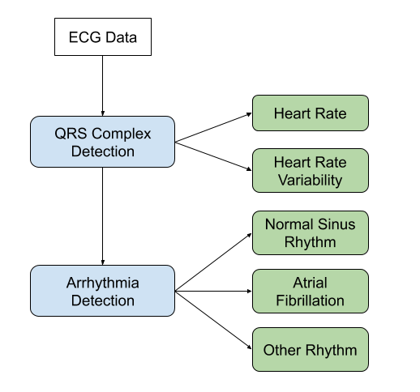

### Atrial-Fibrillation
### Heart Physiology
### QRS Complex Detection
 -  Pan-Tompkins Algorithm
 -  Extending Pan-Tompkins
### Atrial Fibrillation Physiology
### Arrhythmia Detection
 -  Computing in Cardiology Challenge 2017
 -  Data Exploration
 -  Feature Extraction
 -   Modelling
